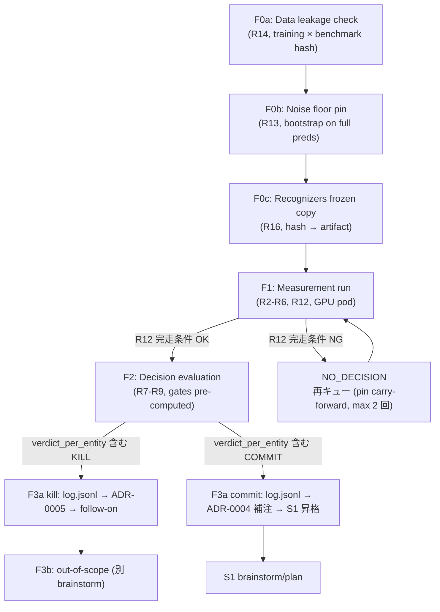

# GiNZA+Presidio Honest Baseline Measurement Infrastructure (S6)

## Summary

ORG/DOB の 2 entity に絞った OSS NER stack (`ja_core_news_trf` / `ja_ginza` / `ja_core_news_md` + Presidio) と現行自前 NER (CNN, BERT-base) の比較 measurement infrastructure を `packages/training/` に追加し、bootstrap CI + Bonferroni 補正 + token-overlap/strict-span 二重 metric + per-template robust gate を pre-compute する artifact 出力までを 7 implementation unit で構築する。kill 経路は ADR-0005 起草テンプレ + experiments/log.jsonl エントリで完了、commit 経路は ADR-0004 補注 + S1 タスク昇格で完了する。

---

## Problem Frame

origin (`docs/brainstorms/2026-05-02-ginza-presidio-baseline-comparison-requirements.md`) で確定した kill-or-commit 判断装置を実装する。背景: 自前 NER 訓練 pipeline は v0.12.0 benchmark で precision 33% / F1 49% に留まり、ORG (-63pt) と DOB (-45pt) で壊れている。OSS 構成との直接比較は内部 corpus 上では未測定で、機会コスト (RunPod GPU 時間 / iter 工数 / annotation pollution リスク) を払い続ける empirical 根拠が不在。本 plan の deliverable は「比較を実行する infrastructure」と「結果を artifact + ADR + log.jsonl に書き戻す段取り」であり、判断そのものは maintainer review に委ねる。

---

## Requirements

- R1. Origin R1 — 比較対象 entity を `ORGANIZATION` と `DATE_OF_BIRTH` に限定 (origin 参照)
- R2. Origin R2 — OSS variant pool は `ja_core_news_trf` / `ja_ginza` / `ja_core_news_md` の 3 構成 + Presidio Regex (origin 参照)
- R3. Origin R3 — Custom 側は CNN と BERT-base 両方を sweep、Bonferroni-style multiple-comparisons 補正適用 (origin 参照)
- R4. Origin R4 — per-variant percentile sweep (score-bearing variants のみ; within-variant rank top-k%、k ∈ {10, 20, 30, 50, 70, 90, 100}; score-less variants は k=100 single point のみ)、tie-break rule は plan で確定 (Key Technical Decisions: 「Score-bearing vs score-less variants の分類」参照)
- R5. Origin R5 — corpus は `packages/training/data/benchmark/v0.12.0/ja/raw.json`、slice は `_meta.template`、span match は token-overlap (≥50% IoU) と strict-span 両方 report
- R6. Origin R6 — RunPod GPU pod 並列実行、time-box は **inference wall-clock のみ ≤ 6h、bootstrap は CPU で post-hoc に実施 (billable clock は別カウント)** で plan-level lock
- R7. Origin R7 — primary gate は `precision ≥ 0.7 制約下 span-count weighted aggregate recall` の差 ≥ `max(3pt, 2× noise_floor)`、Bonferroni α/35 で bootstrap CI 評価
- R8. Origin R8 — robustness gate は (a) per-entity asymmetric min-span filter (ORG ≥5 spans / DOB ≥3 spans; 詳細は後述 Key Technical Decisions: DOB min-span asymmetric threshold 参照)、(b) p10 of per-template recall、(c) token-overlap と strict-span で結論一致
- R9. Origin R9 — 拮抗 commit 倒し、per-entity 独立判定許容 (origin R1/R10 partial-kill 思想と整合、AE 公式化)
- R10. Origin R10 — kill 経路は ADR-0005 起草で ADR-0004 を ORG/DOB 範囲のみ supersede、`packages/training/` の主用途再定義は follow-on に委譲
- R11. Origin R11 — commit 経路は experiments/log.jsonl エントリ追加 + ADR-0004 補注追記 + S1 昇格
- R12. Origin R12 — partial-result 判断は完走条件 (全 OSS + 全 custom + percentile 3 点以上) を満たす場合のみ、満たさなければ no decision で再キュー
- R13. Origin R13 — bootstrap CI (n=1000, span-level resampling)、noise floor は measurement 開始前 pin
- R14. **[Plan 追加]** Data leakage 事前検証 — training corpus と benchmark v0.12.0 corpus の重複検査を **以下の locked specification** で実施 (Phase 1 flow analyzer #4):
  - **Hash algorithm:** SHA256 of NFC-normalized stripped UTF-8 text (改行正規化 LF、前後空白除去、Unicode NFC)
  - **比較 granularity:** (i) doc-level fingerprint (本文 SHA256) + (ii) **template-level fingerprint** (`_meta.template` 値 + 出現 entity 種類のシーケンス、SHA256)
  - **Training corpus manifest:** `data/processed/ja/train.spacy` に至るすべての source files (CHANGELOG-traced + `experiments/log.jsonl` の `intervention_type: data_generation` / `data_augmentation` 由来含む) を `data/benchmark/v0.12.0/ja/training_corpus_manifest.json` に enumerate、各 file の SHA256 を同梱、manifest 自体の SHA256 を artifact に記録
  - **Collision policy:** (i) doc-level overlap が 1 件以上、または (ii) template-level fingerprint 重複が 1 件以上 → **abort** (zero-tolerance)。Maintainer override 不可。AE には「`leakage_check_passed=false` → 全 verdict_per_entity を `NO_DECISION` に強制」を追加。
  - **Artifact schema:** メタの `leakage_check` を boolean ではなく `{algorithm: "SHA256-NFC", manifest_hash: str, doc_overlap_count: int, template_overlap_count: int, passed: bool}` に拡張。
- R15. **[Plan 追加]** Artifact JSON schema を pre-compute verdict セル (`verdict_per_entity` ∈ {`KILL`, `COMMIT`, `NO_DECISION`} + 各 gate boolean + `r7_diff_sign` + `r7_diff_ci_lo/hi`) 含めて固定 (Phase 1 flow analyzer #5, #7)
- R16. **[Plan 追加]** Reproducibility pin set を artifact metadata に同梱 (corpus hash, 各 variant version, Presidio recognizer hash, bootstrap seed, k 値リスト)

**Origin actors:** maintainer (sole agent — egahika)
**Origin flows:** F1 measurement run, F2 decision evaluation, F3a in-scope post-decision, F3b out-of-scope (follow-on)
**Origin acceptance examples:** AE1-AE5 (本 plan の F2 verdict pre-computation で全 AE の機械判定をテスト scenario 化)

---

## Scope Boundaries

- 形式依存 entity (PHONE / MY_NUMBER / CARD / EMAIL / PASSPORT / DRIVER_LICENSE / IP_ADDRESS) の比較は ADR-0004 既決のため触らない
- LLM stage2 verifier (S2) との combined system 比較は本 plan scope 外
- Browser-WASM (S4) は orthogonal、本 plan に含めない
- 本番 traffic 上の shadow inference は scope 外
- `ja_ginza_electra` は spacy-transformers <1.2 の dep conflict で除外 (origin Key Decisions M12)
- ADR-0005 / ADR-0004 補注の **draft template** は本 plan で書くが、決定値の埋め込みと merge は measurement 完了後の maintainer 作業 (本 plan は実行 framework まで)

### Deferred to Follow-Up Work

- **Kill-path follow-on trajectory (P2-6, 順序 + effort 見積):**
  1. **Server-side OSS+Presidio switchover (1-2 weeks):** kill 成立 entity 用 backbone を server に統合、Dockerfile + uv group 再構成、recognizer wiring 切替、E2E test 更新、Fly.io 段階 rollout
  2. **PERSON / ADDRESS / BANK_ACCOUNT 独立比較 (S6 と同等規模、~2-3 weeks/entity):** ORG/DOB 比較 framework を流用、entity ごとの corpus distribution 再評価、AE 設計
  3. **`packages/training/` の主用途再定義 (要 brainstorm、effort 不確定):** training package の存在意義が縮退する場合、recognizer YAML 量産パイプライン化 / benchmark management / synthetic data generation 等への重心移動を別 brainstorm で議論
  4. **実用可能 model 到達までの compound timeline:** (1) → (2) で ORG/DOB 以外の entity を順次 OSS 化、(3) は (1)(2) 並行で議論、合計 6-12 weeks の compound timeline で kill 経路は完了
- **Commit-path follow-on:**
  - S1 (`recall@FP-budget` 評価指標再設計、commit 経路成立時): 別 brainstorm
  - ADR-0004 amendment (補注 PR、commit 経路成立時): post-measurement に別 PR (P2-1)
- ADR-0004 numbering collision (`0004-invitely-integration.md` との重複) の整理: 別 PR で解決

---

## Context & Research

### Relevant Code and Patterns

- **Existing benchmark scripts (mirror naming + I/O conventions):**
  - `packages/training/src/pleno_ner_training/evaluate_benchmark.py` — `Scorer`-based eval、`scores.json` schema を継承
  - `packages/training/src/pleno_ner_training/benchmark_external.py` — `LABEL_MAP_JA` で GiNZA 系 label を 5 entity に project、ただし strict-span only (本 plan で token-overlap も追加)
  - `packages/training/src/pleno_ner_training/benchmark_huggingface.py` — `HF_MODEL_CONFIGS` registry pattern を `BASELINE_REGISTRY` の参照モデルに
  - `packages/training/src/pleno_ner_training/benchmark_config.py` — `BENCHMARK_CONFIGS[version]` の single source of truth、v0.12.0 設定を流用
- **Server-side Presidio integration (reference for OSS+Presidio variant wiring):**
  - `server/src/app.py` の `MultiLangSpacyNlpEngine` パターン (subclass `SpacyNlpEngine`、models dict 注入、`AnalyzerEngine(nlp_engine=..., supported_languages=...)`)
  - `server/src/recognizers_ja.py` の `ALL_JA_RECOGNIZERS` (14 recognizers) — 本 plan ではこれを `packages/training/` 側に共有可能な形にする
- **Experiment tracking:**
  - `packages/training/experiments/log.jsonl` (21 entries、確定 schema: `id` / `timestamp` JST ISO8601 / `hypothesis` / `intervention_type` / `language` / `changes` / `metrics_before` / `metrics_after` / `delta` / `verdict` / `reason` / `duration_minutes`) — 後方互換に `intervention_type: "baseline_comparison"` と `verdict: "KILL" | "COMMIT" | "NO_DECISION"` を追加
- **RunPod runbook to mirror:**
  - `packages/training/docs/runpod-training.md` — CPU 専用、構造 (推奨インスタンス表 / OOM 事例表 / SCP via exposed TCP / `nohup` パターン / Terminate チェックリスト) を GPU runbook の雛形にそのまま流用
- **Benchmark corpus verified distribution:**
  - `packages/training/data/benchmark/v0.12.0/ja/raw.json` — 500 docs / 41 templates、positive 7 templates: `ocr_forms_a` (ORG=8/DOB=6) / `payment_exports_a` (ORG=10/DOB=7) / `logistics_labels_b` (ORG=5/DOB=2) / `mixed_dummy_real_a` (ORG=5/DOB=2) / `leaked_attachments_a` (ORG=6/DOB=4) / `partially_redacted_public_a` (ORG=3/DOB=2) / 7 番目 (research では unnamed、要確認)
- **Configs to reference:**
  - `packages/training/configs/train_cnn.cfg` (CNN baseline)
  - `packages/training/configs/train_transformer.cfg` (BERT-base `cl-tohoku/bert-base-japanese-v3` baseline)
  - `output/ja-v02-trf/model-best` (BERT 既訓練 artifact、存在検証必要)
- **Project conventions (`/Users/hikae/.claude/CLAUDE.md` user-global):**
  - `uv run python -m ...` で Make ターゲット呼び出し (`packages/training/Makefile`)
  - **「use runpod for training (use chrome mcp); do not train on local machine」** — RunPod orchestration は Chrome MCP 経由
  - 実装後は release して動作確認するまでがタスク完了

### Institutional Learnings

- `docs/solutions/` 不在 — bootstrap CI / Bonferroni / per-template aggregation / span-match dual metric は **本リポ greenfield**。タスク完了後に `/ce-compound` で institutional learning に昇格させる価値が高い
- 既存 `benchmark_external.py` の `gold_ents = {(start_char, end_char, ent.label_)}` 完全一致は origin M9 (UD/GSD 境界規則差で OSS 不利) を再現するパターンの正体。本 plan では token-overlap (≥50% IoU) と strict-span を **独立に集計**
- `packages/training/CHANGELOG.md` の "Key Insights": data quality > data quantity > parameter tuning。RunPod CPU5 8vCPU/16GB 最小、OOM はメモリ 100% で SSHd ごと落ちる教訓 — GPU pod でも VRAM 100% 達で同様の罠あり、開始 5 分以内に `nvidia-smi` 確認手順を runbook に必須化
- `experiments/log.jsonl` の `intervention_type` 既存値: `data_augmentation` / `data_generation` / `training_config`。本 plan で `baseline_comparison` を追加する convention 拡張になる

### External References

- Origin doc 内に既存 (PubMed 2025 GiNZA+Presidio recall 0.995 / Sci Reports 2026 Mistral-Small-3.2 + Self-Refine / ACL 2025 data-constrained synthesis / NVIDIA Nemotron-PII)。本 plan では再 fetch せず、origin の grounding を継承

---

## Key Technical Decisions

- **`packages/training/` 内 inline 実装、新 package を切らない:** 既存 `evaluate_benchmark.py` / `benchmark_external.py` / `benchmark_huggingface.py` と命名・I/O・Make ターゲット convention が確立済み。新 `packages/eval/` は `BENCHMARK_CONFIGS` 重複か workspace dep 重発生で技術負債化する (repo-research-analyst 推奨)。
- **DOB min-span asymmetric threshold (origin R8(a) refinement; data-peek acknowledged):** 7 positive templates の実測 (raw.json) では DOB ≥5 spans を満たす template は **2** (`ocr_forms_a`=6, `payment_exports_a`=7)、ORG ≥5 spans を満たす template は **5**、DOB ≥3 spans を満たす template は **3** (`ocr_forms_a`=6, `leaked_attachments_a`=4, `payment_exports_a`=7)。origin の文言「ORG/DOB 合計 ≥ 5」をそのまま per-entity 評価で適用すると DOB の p10 計算が縮退する。Plan で **per-entity asymmetric threshold** に refine: ORG は templates with ≥5 ORG spans (= **5 templates** 該当)、DOB は templates with ≥3 DOB spans (= **3 templates** 該当) を p10 評価対象とする。Origin の「合計 ≥5」は template 全体の eligibility (low-noise 確保) として残す。
  - **Resolution path (b-iii) 採用:** per-entity refine を残しつつ、corpus 薄を明示 acknowledge。`n_eligible_templates < 4` を満たす entity (現状 DOB が該当: 3 templates) は verdict を `NO_DECISION` に強制する **eligibility guard** を追加 (U4 verdict pre-compute で実装)。これにより corpus n が小さい entity は kill 経路に流れない構造的防御を入れる。
  - **Pre-Registration 整合 (P0-4 参照):** 本 refinement は origin brainstorm の amendment ではなく、本 plan PR merge SHA 時点で deferred-locked される。閾値変更は data-peek 由来 (raw.json の実測 span 数を見て決めた) であることを明示的に acknowledge し、F0c 以降の rule mutation は禁止 (Pre-Registration Commitment 参照)。
- **Per-entity independent verdict (origin AE 公式化):** ORG と DOB の verdict (`KILL` / `COMMIT` / `NO_DECISION`) を独立に算出。ORG KILL 成立 + DOB COMMIT (拮抗 or R8 崩れ) は origin R1/R10 の partial-kill 思想と整合する有効な outcome。Artifact の `verdict_per_entity` が両 entity の状態を carry し、ADR-0005 起草時は KILL 成立 entity のみ対象とする。
- **Data leakage 事前検証 step (R14, locked specification):** measurement 開始前に F0a として training corpus と benchmark v0.12.0 corpus の重複検査を SHA256 (NFC-normalized) で実行 (詳細は R14 参照)。doc-level fingerprint + **template-level fingerprint** (`_meta.template` 値 + entity 種類シーケンス) の 2 軸で比較。Training corpus manifest (`data/benchmark/v0.12.0/ja/training_corpus_manifest.json`) を enumerate して artifact に hash を記録。重複が 1 件でも検出されたら **zero-tolerance abort** (maintainer override 不可) し、AE は当該 run の verdict_per_entity を全て `NO_DECISION` 扱い。
- **Tie-break rule for percentile sweep (R4):** score-bearing variants の予測 span を `(score, doc_id, span_start)` の lexicographic order で sort し top-k% を採用。Score-less variants (Doc.ents のみ; 詳細は「Score-bearing vs score-less variants の分類」参照) は percentile sweep を実施せず k=100 single point のみで評価する。Tie-break rule と score_availability flag は artifact メタに記録 (再現性)。
- **Presidio recognizer pack — git SHA reference + content hash 検証 (R16, P1-7):** F0c では vendor/ にファイルを書かない。代わりに `packages/training/src/pleno_ner_training/recognizers_ja.py` の (i) git SHA (containing commit) と (ii) content SHA256 (NFC-normalized stripped UTF-8) の 2 値を計算し、artifact metadata `recognizers_pack_git_sha` / `recognizers_pack_content_sha256` に記録。Run 時は `git show <sha>:packages/training/src/pleno_ner_training/recognizers_ja.py` で取得して content hash を再計算、不一致なら abort。これにより duplicate-source 化リスクを根本解消し、比較期間中のドリフトは git SHA pin で構造的に防止する。
- **`packages/training/tests/` を本 plan で新設:** 現状 packages/training/ に test ディレクトリが無く、`metrics.py` の bootstrap CI / Bonferroni 実装は silently mis-compute すれば kill-or-commit 判断を歪める。U2 で test ディレクトリを scaffold し metrics の正確性を unit test で固定する。
- **F3a step ordering (Phase 1 flow #6):** kill 経路は (1) experiments/log.jsonl エントリ append (audit trail として最優先) → (2) ADR-0005 draft PR open → (3) ADR-0005 merge → (4) follow-on issue 起票。commit 経路は (1) experiments/log.jsonl append → (2) ADR-0004 補注追記 PR open → (3) S1 task 昇格通知。log.jsonl が先に landed することで、ADR が draft 状態でも audit trail は残る。
- **AE pre-computation in artifact (Phase 1 flow #7):** R7/R8 の各 gate を artifact JSON で boolean 列として pre-compute (`r7_primary_gate`, `r8a_min_span_filter`, `r8b_p10_robust`, `r8c_dual_metric_agree`)。Default verdict は artifact に焼かれる。**Override 制約 (P0-4 強化):** maintainer による verdict 値の override は (1) artifact 内 `override_rationale: str` の必須記入、(2) ADR-0005 (kill 経路) もしくは ADR-0004 amendment (commit 経路) への override 理由の文書化、(3) `experiments/log.jsonl` audit-trail への明示記録、の 3 点を満たした場合のみ許容。これらを満たさない override は invalid。

- **Score-bearing vs score-less variants の分類 (R4 refinement, P0-5):** percentile sweep の前提として variants を 2 群に分類:
  - **Score-bearing variants:** Presidio-wrapped OSS (RecognizerResult.score を保持)、HF transformer-based custom variants (per-token softmax 由来 score)。これらは k ∈ {10, 20, 30, 50, 70, 90, 100} の percentile sweep を実施。
  - **Score-less variants:** spaCy default `ner` の `Doc.ents` (per-span confidence 無し)、custom CNN/BERT が `Doc.ents` 経由のみ score を出さない場合。これらは percentile sweep を行わず **k=100 single point のみ** で評価し、R7 primary gate には参照点として entry。
  - **R7 primary gate の比較対象:** percentile sweep aggregate は score-bearing variants 間の比較にのみ適用。score-less variants は k=100 single point として primary gate の参考値に入る (確率的な top-k% confidence sort は不可能なため)。
  - artifact `metadata.score_availability` (per variant boolean) を必須化、`measurements` rows は score-less variant の k≠100 entry を含めない。

- **Verdict mapping function (P1-4):** 4 gate boolean + R7 diff sign / CI から verdict を確定する pure function を `metrics.py` に実装:
  ```python
  def compute_verdict(gates: dict[str, bool], diff_sign: str, diff_ci: tuple[float, float], n_eligible_templates: int) -> str:
      # eligibility guard (P0-1 b-iii)
      if n_eligible_templates < 4:
          return "NO_DECISION"
      if not all(gates.values()):
          return "NO_DECISION"
      # all gates true
      lo, hi = diff_ci
      if diff_sign == "oss_better" and lo > 0:
          return "KILL"
      if diff_sign == "custom_better" or (lo <= 0 <= hi):
          return "COMMIT"
      return "NO_DECISION"
  ```
  artifact `verdict_per_entity` は `r7_diff_sign` ∈ {`oss_better`, `custom_better`, `tied`} と `r7_diff_ci_lo` / `r7_diff_ci_hi` を必須フィールドとして含む。

- **Per-entity independent verdict — operational cost (P1-5 enumeration):** ORG と DOB を独立に判定することで partial verdict (例: ORG=KILL + DOB=COMMIT) が成立し得るが、これは server 側に以下の 4 種類の operational cost を持ち込む:
  1. **2-backbone runtime:** kill 成立 entity 用に OSS+Presidio backbone を、commit 成立 entity 用に既存 custom backbone を同時 load する必要があり、推論時に 2 nlp pipeline を直列または並列実行。
  2. **Span overlap arbitration policy:** ORG (OSS) と DOB (custom) が同 char 範囲を別 label で予測した場合の優先規則を定義する必要があり、follow-on brainstorm の必須議題。
  3. **Memory / cold-start footprint:** transformer + custom CNN を同 process に lock すると VRAM/RAM 倍増、cold start latency も悪化。Fly.io 制約 (image size, GPU 不在) との trade-off は follow-on の必須 deliverable。
  4. **S2 LLM verifier semantics:** 2 backbone 由来の span を S2 verifier に渡す際の confidence 統合規則を S1 設計で integrated に扱う必要あり。
  - **Conservative default policy:** partial verdict 成立時、operational cost 受け入れが follow-on brainstorm で confirm されるまでは「失敗 entity (verdict ≠ KILL の entity) を full kill (= server 側 backbone を残す)」を default 選択肢として artifact に併記。Maintainer が partial 採用を選ぶ場合は ADR-0005 で operational cost への対処を明記する。

- **Noise floor pre-pinning lifecycle (R13 + R12) — refined:** F0b として全 variant の predictions に対し bootstrap で per-entity noise floor を 1 回計算し `data/benchmark/v0.12.0/ja/noise_floor.json` に pin (commit 対象、artifact メタにも hash 同梱)。Lifecycle は以下の 4 ケースで分岐:

  | ケース | Action | 理由 |
  |--------|--------|------|
  | (1) R12 partial による requeue (corpus / variant set / leakage manifest 不変) | **carry-forward** (再計算しない) | Sunk Cost Protection、measurement 再現性 |
  | (2) Variant 集合の追加・除外 | **強制 recompute** + 別 PR で議論 | noise floor は variant 集合に依存 |
  | (3) Corpus version (raw.json) 変更 | **強制 recompute** + 別 PR | noise floor は corpus 固有 |
  | (4) Leakage manifest hash 変更 (training corpus 修正含む) | **強制 recompute** + F0a 再実行 | leakage 修正後の bad floor 残留防止 |

  Manifest hash mismatch は artifact metadata に warn として記録、carry-forward 拒否時は明示的に reason を残す。

- **Recognizers pack — git SHA reference + content hash 検証 (P1-7):** 旧案の物理 frozen copy (`vendor/recognizers_ja_<hash>.py`) は新たな duplicate-source 化リスクを生むため撤回。代替として **git SHA reference 方式** を採用:
  - vendor/ にファイルを書かない (Output Structure からも削除)。
  - artifact metadata に `recognizers_pack_git_sha` (`packages/training/src/pleno_ner_training/recognizers_ja.py` を保持する commit SHA) と `recognizers_pack_content_sha256` (NFC-normalized UTF-8 stripped 内容の SHA256) の 2 値を記録。
  - run 時は `git show <sha>:packages/training/src/pleno_ner_training/recognizers_ja.py` で取得し content hash を再計算、artifact 記録値と一致しない場合は abort。
  - 比較期間中の server 側更新ドリフト防止は git SHA pin で達成、duplicate-source 化リスクを根本解消。

- **`recognizers_ja.py` の物理移動 vs path-dep (P0-2 trade-off 再確認):** server から training への cross-package import は (a) `pleno-anonymize-server` の path-dep 追加 + frozen copy (drift 防止)、(b) `recognizers_ja.py` を `packages/training/src/pleno_ner_training/recognizers_ja.py` に物理移動して `server/src/app.py` から逆 import、の二択。本 plan では (b) を採用。
  - **(b) 採用理由:** duplicate-source 化リスクを根本解消し、user 指示「技術負債を洗い出す」と整合。Import path が単一になり、CHANGELOG 追跡も 1 箇所で完結。
  - **(a) frozen-copy-eliminates-drift counter-argument 検討:** path-dep + 自動 frozen copy で drift は技術的には防止可能だが、(i) 2 source-of-truth の同期 burden が継続的に発生、(ii) frozen copy 同期忘れの sandbox-trap が発生し得る、(iii) test 時の import が分岐し integration coverage が薄まる、の理由で (b) より弱い。
  - **(b) の identity 方向シグナル (FYI-2):** server (プロダクト本体) → training (upstream tooling) の dep 逆転は「training を recognizer pack の owning package にする」という identity bet。alternative として「small shared package (`pleno-recognizers-ja`) を server / training 双方が depend」も enumerate するが、新 workspace member 追加コストが高く本 plan scope 超過のため不採用。
  - **Server image impact:** U1 で uv group 分離 (server-image は `[bench]` extras を除外) + `flyctl deploy --build-only` dry-run gate を必須化することで image size 増を構造的に抑制 (詳細は U1 Deployment image impact 参照)。

- **Corpus repair alternative の opportunity-cost analysis (P2-5):** DOB span 数が薄い (3 templates) ことへの対処として、本 plan の per-entity asymmetric threshold + eligibility guard 採用以外に「DOB-rich templates (e.g., `medical_records_a`, `personal_history_b`) を 2-3 件 annotate して既存 benchmark v0.12.0 を再 release してから measurement する」という corpus-repair alternative を検討した。Reject 理由は以下:
  - (1) annotation 工数 (2-3 templates × ~50 docs × ORG/DOB × peer review = 1-2 weeks) が本 plan の time-box (6h inference + 1-2 days analysis) を越え、kill-or-commit 判断を待たせる
  - (2) corpus 拡張は新たな bias source (annotator effect) を導入し、現行 v0.12.0 の statistical comparability を壊す
  - (3) eligibility guard で `n_eligible_templates < 4 → NO_DECISION` を強制すれば corpus 薄起因の false-kill は構造的に防げる
  - (4) corpus 拡張それ自体は別 brainstorm (benchmark-evolve スキルの所掌) でより包括的に扱う方が適切

---

## Pre-Registration Commitment

本 plan は kill-or-commit 判断装置を提供する性質上、verdict-decision-rule の immutability を構造的に約束する必要がある。Single maintainer の self-administration を補い、Bonferroni / dual-metric の structural defense が theatrical にならないよう、以下を pre-registration として lock する。

### Registration Anchor

- **Anchor:** 本 plan PR が main に merge された時点の commit SHA を verdict rule の registration 基準とする。
- **Anchor SHA の provenance (実装での読み出し方法):** anchor SHA は `packages/training/data/benchmark/v0.12.0/ja/anchor_sha.txt` に commit (本 plan PR merge 直後に follow-up commit で記入、もしくは PR merge 時の squash commit SHA を post-merge automation で書き込む)。`compare_baselines.py` の orchestrator は本 file から anchor SHA を読み出し、F0d で `git diff <anchor_sha> -- packages/training/src/pleno_ner_training/metrics.py` を取り差分があれば run abort。Override が必要な場合は CLI flag `--anchor-sha-override <sha>` を提供するが、override 使用時は `experiments/log.jsonl` への audit entry が必須 (Pre-Registration override constraint と同等規定)。
- **Frozen scope:** 以下の 4 構成要素は anchor SHA で freeze される:
  1. `packages/training/src/pleno_ner_training/metrics.py` 内のすべての関数 (bootstrap_ci, matched_precision_budget_recall, token_overlap_f1, strict_span_f1, per_template_recall, p10, bonferroni_correct, compute_verdict, sort helpers)
  2. R7/R8 の threshold constants (e.g., `precision >= 0.7`, `max(3pt, 2× noise_floor)`, Bonferroni `α/35`, IoU `>=0.5`)
  3. R8(a) per-entity asymmetric threshold (ORG ≥5 spans / DOB ≥3 spans) と eligibility guard (`n_eligible_templates < 4 → NO_DECISION`)
  4. `compute_verdict` の gate-to-verdict mapping function 全体
- **Pre-registration の data-peek 由来 acknowledgement:** 上記 (3) の per-entity 閾値は raw.json の実測 span 数を見て決定したものであり、data-peek 由来の refinement であることを明示的に acknowledge する。Anchor SHA で freeze することでそれ以降の peek-driven mutation を遮断する。

### Mutation Window Closure

- **Closed window:** F0c 完了 (recognizers pack の git SHA pin 確定) から F2 完了 (artifact `comparison.json` 書き出し) までの期間中、上記 frozen scope (1)-(4) の変更を一切禁止する。
- **Audit hook:** orchestrator (U4) は実行開始時に `metrics.py` および関連 constants の `git diff anchor_sha -- packages/training/src/pleno_ner_training/metrics.py` を取り、差分があれば run を **abort** + `noise_floor.json` を再計算対象として mark し、当該 run_id を invalidate する。
- **Audit logging requirement:** verdict 計算後 (F2 完了後) に rule を変更した場合は、`experiments/log.jsonl` に `intervention_type: "rule_amendment"` の entry を必須記録 (該当 run_id, 変更 file, 変更 rationale, ADR-0005 / amendment PR link を fields として持つ)。

### Override Constraint

- 単独 maintainer の self-administration を補うため、verdict 値の override (artifact `verdict_per_entity` を post-hoc に書き換える行為) は以下の 3 条件をすべて満たした場合のみ許容:
  1. **Documented rationale:** override 理由を artifact 内 `override_rationale: str` field に記入 (空文字列禁止、最低 200 chars)
  2. **ADR-level documentation:** kill 経路では新 ADR (ADR-0005 系) で、commit 経路では ADR-0004 amendment で、override 理由を section として inline 化
  3. **Audit trail:** `experiments/log.jsonl` に `intervention_type: "verdict_override"` の entry (run_id, original_verdict, overridden_verdict, rationale_summary) を append
- 上記を満たさない override は invalid と見なし、外部 reviewer は当該 verdict を引用しないこと。

### Rule Amendment Procedure

- 上記 frozen scope (1)-(4) の意図的変更は、本 plan を amendment する **新 PR** で行う。amendment PR には (i) 旧 rule で計算した verdict、(ii) 新 rule で計算した verdict、(iii) 差異の理由、を必須記載。
- amendment merge 後、以前の anchor SHA で計算した artifact は historical reference として保持されるが、新 anchor SHA 以降の判断は新 rule で再計算した artifact のみが authoritative。

---

## Open Questions

### Resolved During Planning

- **Q1 (origin Resolve Before Planning, GPU runbook):** U6 の deliverable として `packages/training/docs/runpod-gpu-inference.md` を新規作成 (CPU runbook 構造踏襲 + GPU 固有差分追加)。Pod size, CUDA version, install path, VRAM 確認手順を含む。
- **Q4 (origin Resolve Before Planning, server 切替 PR timing):** F3b に従い follow-on brainstorm 委譲を default。本 plan の R10 deliverable は ADR-0005 draft template まで、server 切替 PR は別作業。
- **Bonferroni α/35 multiplicity:** origin の「3 OSS variants × 7 percentiles + 2 custom variants × 7 percentiles = 35 configs」を採用、metrics.py で `bonferroni_correct(p_values, m=35)` をハードコード。Per-entity の 2 hypotheses (ORG, DOB) はさらなる多重性として扱わず、entity ごとに独立に α/35 で評価 (per-entity 判定の独立性を保つ)。
- **DOB min-span threshold:** Key Technical Decisions の per-entity asymmetric (ORG ≥5 = 5 templates 該当、DOB ≥3 = 3 templates 該当) + `n_eligible_templates < 4` 時 `NO_DECISION` を強制する eligibility guard (P0-1 b-iii)。
- **Tie-break rule:** score-bearing variants は `(score, doc_id, span_start)` lexicographic; score-less variants は k=100 single point のみ。
- **Time-box 6h clock scope:** **inference wall-clock のみ ≤ 6h、bootstrap は CPU で post-hoc に実施 (billable clock は別カウント)** で plan-level lock (R6)。

### Deferred to Implementation

- [Affects U4] RunPod ジョブを単一 pod で variant × percentile sweep を回すか、variant ごとに別 pod に並列化するか — コスト最適とログ集約の trade-off で U6 RunPod runbook 起票時に判断
- [Affects U7] ADR-0005 と ADR-0004 補注の文言は measurement 結果を見て maintainer が記入する。本 plan は template と記入位置を確定させるが本文確定は execution-time
- [Affects U2] Bootstrap span-level resampling の正確な seed 戦略 (run-id seed vs corpus-version seed) — `metrics.py` 実装時に決定、artifact メタに seed strategy 名と value を記録
- [Affects U3] `ja_ginza` の internal score / rank 取得 path の正確な API (GiNZA のバージョンによって `Token._.score` 等の API が異なる可能性) — 実装時に変動を吸収

---

## High-Level Technical Design

> *この図は実装の方向性を示す directional guidance であり、実装仕様ではない。実装エージェントは context として扱い、コードを再現すべきではない。*



artifact JSON の概略 shape (詳細は U5 で固定):

```jsonc
{
  "schema_version": "1.0",
  "run_id": "<timestamp>_<corpus_hash>",
  "metadata": {
    "corpus_hash": "...",
    "noise_floor_hash": "...",
    "recognizers_pack_git_sha": "...",
    "recognizers_pack_content_sha256": "...",
    "variant_versions": {"ja_core_news_trf": {"version": "...", "wheel_sha256": "..."}, "ja_ginza": {"version": "..."}, "...": "..."},
    "score_availability": {"ja_core_news_trf": true, "ja_ginza": true, "ja_core_news_md": false, "custom_cnn": false, "custom_bert": true},
    "bootstrap_seed": 42,
    "tie_break_rule": "(score, doc_id, span_start) for score-bearing; k=100 single-point for score-less",
    "k_values": [10, 20, 30, 50, 70, 90, 100],
    "leakage_check": {"algorithm": "SHA256-NFC", "manifest_hash": "...", "doc_overlap_count": 0, "template_overlap_count": 0, "passed": true},
    "anchor_sha": "<plan PR merge SHA>",
    "anchor_diff_clean": true
  },
  "measurements": [
    {"variant": "ja_core_news_trf", "k_percentile": 50, "entity": "ORG",
     "template": "ocr_forms_a", "tp": ..., "fp": ..., "fn": ...,
     "token_overlap_f1": ..., "strict_span_f1": ..., "matched_p_recall": ...}
    // per-(variant, percentile, entity, template) row
  ],
  "aggregates": {
    "ORG": {
      "oss_best": {"variant": "...", "k": ..., "recall": ..., "ci": [lo, hi]},
      "custom_best": {"variant": "...", "k": ..., "recall": ..., "ci": [lo, hi]},
      "diff": ..., "diff_ci_bonferroni": [lo, hi],
      "p10_per_template": {...}
    },
    "DOB": { ... }
  },
  "verdict_per_entity": {
    "ORG": {"verdict": "KILL|COMMIT|NO_DECISION",
            "r7_primary_gate": true, "r8a_min_span_filter": true,
            "r8b_p10_robust": true, "r8c_dual_metric_agree": true,
            "r7_diff_sign": "oss_better|custom_better|tied",
            "r7_diff_ci_lo": -0.02, "r7_diff_ci_hi": 0.05},
    "DOB": { ... }
  },
  "partial_run": false
}
```

---

## Output Structure

```text
packages/training/
├── src/pleno_ner_training/
│   ├── baselines_ja.py               (NEW, U3)
│   ├── metrics.py                    (NEW, U2)
│   ├── compare_baselines.py          (NEW, U4)
│   ├── artifact.py                   (NEW, U5)
│   ├── recognizers_ja.py             (MOVED from server/, U1)
│   ├── benchmark_external.py         (existing, untouched)
│   ├── evaluate_benchmark.py         (existing, untouched)
│   └── ...
├── tests/                            (NEW directory, U2)
│   └── test_metrics.py               (NEW, U2)
├── docs/
│   ├── runpod-training.md            (existing)
│   └── runpod-gpu-inference.md       (NEW, U6)
├── data/benchmark/v0.12.0/ja/
│   ├── raw.json                      (existing)
│   ├── test.spacy                    (existing)
│   ├── scores.json                   (existing)
│   ├── noise_floor.json              (NEW, F0b output, U4)
│   ├── training_corpus_manifest.json (NEW, F0a output, U4 — leakage check enumeration)
│   └── anchor_sha.txt                (NEW, post-merge follow-up commit, U4 reads at F0d — Pre-Registration anchor)
├── experiments/
│   ├── log.jsonl                     (existing, schema-extended in U4)
│   └── artifacts/
│       └── <run_id>/
│           ├── comparison.json       (NEW, U5 output)
│           └── pareto_data.json      (NEW, U5 output)
├── pyproject.toml                    (MODIFIED, U1: [bench] extras)
└── Makefile                          (MODIFIED, U6: new targets)

server/
├── src/
│   └── app.py                        (MODIFIED, U1: import from training)
├── pyproject.toml                    (MODIFIED, U1: workspace dep on training, server-image excludes [bench] group)
└── ...

Dockerfile                            (MODIFIED, U1: workspace-aware build, COPY packages/training + server, uv sync --no-group bench)

docs/adr/
└── 0005-...md                        (NEW template only, U7 — body filled post-measurement)
```

---

## Implementation Units

- U1. **Project scaffolding: deps, recognizers move, tests dir**

**Goal:** OSS variant 群と Presidio を `packages/training/` から呼び出せる依存・import 構造を整える。`recognizers_ja.py` の duplicate-source 化を防ぐため server から training に物理移動し、server 側を逆 import に切替。`packages/training/tests/` を新設して以後の unit test を受け入れ可能にする。

**Requirements:** R1, R2, R3 (origin)、Phase 1 repo-research-analyst 推奨

**Dependencies:** None (最初の unit)

**Files:**
- Modify: `packages/training/pyproject.toml` — `[project.optional-dependencies] bench = ["presidio-analyzer>=2.2", "presidio-anonymizer>=2.2", "ginza>=5.2", "ja-ginza>=5.2", "numpy>=1.26", "scipy>=1.11"]`、加えて `ja_core_news_trf` の wheel URL 追加 (`server/pyproject.toml:29` の `en-core-web-sm` パターン参照、wheel URL に **`#sha256=<hex>` 形式の sha256 checksum を inline で併記** し supply-chain integrity を gating)。PyPI 名称は `ja-ginza` (ハイフン)、import / spacy.load は `ja_ginza` (アンダースコア)。Wheel hash は `variant_versions[<name>].wheel_sha256` として artifact metadata にも記録 (R16 拡張)。
- Move: `server/src/recognizers_ja.py` → `packages/training/src/pleno_ner_training/recognizers_ja.py`
- Modify: `server/src/app.py` — `from pleno_ner_training.recognizers_ja import ALL_JA_RECOGNIZERS`
- Modify: `server/pyproject.toml` — training への workspace dep 追加 (`pleno-ner-training = { workspace = true }`)、ただし `[bench]` extras は server-image build 時に **install しない** (uv group 分離)
- Modify: **`Dockerfile`** (server-image, root or `server/`) — workspace-aware build に書き換え (詳細は Deployment image impact 参照)
- Modify: `server/tests/test_recognizers_ja.py` — import path 更新
- Modify: `server/tests/test_e2e_anonymize.py` — import path 更新 (もし影響あれば)
- Modify: `server/tests/conftest.py` — 同上
- Create: `packages/training/tests/__init__.py` (空)
- Create: `packages/training/tests/conftest.py` (pytest fixtures)

**Deployment image impact (P0-2):**
- **Dockerfile workspace-aware rewrite:** 旧 Dockerfile は `COPY server/pyproject.toml uv.lock ./` + `COPY server/src/ src/` のみで packages/training を image に含めず、`recognizers_ja.py` 物理移動後は ModuleNotFoundError でコンテナ起動失敗する。U1 で以下に書き換え:
  ```dockerfile
  COPY pyproject.toml uv.lock ./
  COPY packages/training/pyproject.toml packages/training/pyproject.toml
  COPY server/pyproject.toml server/pyproject.toml
  RUN uv sync --frozen --no-install-project --no-group bench
  COPY packages/training/ packages/training/
  COPY server/ server/
  RUN uv sync --frozen --no-group bench
  CMD ["uv", "run", "uvicorn", "server.src.app:app", "--host", "0.0.0.0", "--port", "8080"]
  ```
- **`flyctl deploy --build-only` dry-run gate:** U1 verification の必須項目として `flyctl deploy --build-only` の dry-run pass を CI に組み込む。Image size の baseline (移動前) との比較も verification 項目に追加し、増加分が 50MB を越える場合は warn。
- **uv group 分離 (server-image excludes [bench] extras):** `[project.dependencies]` には presidio など runtime 必須のみ、`[project.optional-dependencies] bench = [...]` (or `[dependency-groups] bench`) に OSS variants (ginza, ja-ginza, ja_core_news_trf wheel) を切り出す。Server image build では `uv sync --no-group bench` で OSS variants を除外、image size 膨張を構造的に抑制。
- **uvicorn `--reload-dir packages/training/src` dev runbook 注記:** dev loop で `recognizers_ja.py` を変更した際の hot-reload を効かせるため、`uvicorn` 起動時に `--reload --reload-dir server/src --reload-dir packages/training/src` を併用するよう README/runbook に注記。

**Approach:**
- recognizers_ja.py の物理移動を一括 PR で行い、server 側 import を更新
- training の `pyproject.toml` に `[bench]` extras を追加し `uv sync --group bench` で OSS variant + Presidio を install 可能に
- `ja_core_news_trf` は spaCy の wheel URL 指定で reproducible install (PyPI 経由ではなく明示 URL)
- `packages/training/tests/` を新設、CI で `uv run pytest packages/training/tests/` を回せるようにする (CI workflow 修正は本 unit に含める)
- recognizers の物理移動で server CI が壊れないことを `uv sync && uv run pytest server/tests/` で先に確認

**Patterns to follow:**
- `server/pyproject.toml:29` の wheel URL pattern (en_core_web_sm)
- `server/pyproject.toml` の `[tool.pytest]` 設定を training にも mirror

**Test scenarios:**
- Happy path: `uv sync --group bench` が 3 OSS variants + Presidio を resolve できる
- Happy path: `uv run pytest server/tests/` が recognizers_ja 移動後も全 pass
- Edge case: training と server の両方を同 venv で install しても dep conflict が出ない (spacy-transformers >=1.3 が両方で許容される、`ja_ginza_electra` を [bench] に含めないことで保たれる)
- Integration: `from pleno_ner_training.recognizers_ja import ALL_JA_RECOGNIZERS` が server / training 両方で同一オブジェクトを返す
- Test expectation: pytest を回し既存 server tests が green に保たれることを確認

**Verification:**
- `uv sync --group bench` 成功
- `uv run pytest server/tests/` の pass 数が移動前と同等
- `uv run python -c "from pleno_ner_training.recognizers_ja import ALL_JA_RECOGNIZERS; print(len(ALL_JA_RECOGNIZERS))"` が 14 を返す
- **`flyctl deploy --build-only` dry-run pass** (Dockerfile workspace-aware rewrite が機能する確認)
- **Image size baseline 比較**: 移動前 image size と比較し、増加分が 50MB 以下であること
- **uv install verification**: `uv sync --frozen` 後に wheel sha256 (pyproject.toml に inline pin したもの) が installed wheel と一致するか `uv pip list --format=json` 等で確認

---

- U2. **Statistical primitives: bootstrap CI, matched-precision recall, span match dual metric, Bonferroni**

**Goal:** kill-or-commit gate に必要な統計関数を `metrics.py` に純粋関数として実装し、unit test で正確性を固定する。本 unit が誤ると判断が静かに歪むため `packages/training/tests/test_metrics.py` での coverage が必須。

**Requirements:** R5 (token-overlap + strict-span), R7 (matched-precision recall + Bonferroni), R8 (per-template aggregation, p10), R13 (bootstrap CI)

**Dependencies:** U1 (tests dir scaffold)

**Files:**
- Create: `packages/training/src/pleno_ner_training/metrics.py`
- Create: `packages/training/tests/test_metrics.py`

**Approach:**
- 純粋関数のみ、I/O 無し。span tuple `(start, end, label)` を入力に取り、TP/FP/FN を返す primitive 群
- `bootstrap_ci(samples, n=1000, alpha=0.05, seed=int)` — span-level resampling、`(lo, hi, mean)` を返す
- `matched_precision_budget_recall(predictions_with_scores, gold, label, p_budget=0.7)` — predictions を score でソート、precision ≥ p_budget を満たす最も recall が高い operating point の recall を返す
- `token_overlap_f1(pred_spans, gold_spans, iou_threshold=0.5)` — IoU ≥ 0.5 で match 判定
- `strict_span_f1(pred_spans, gold_spans)` — exact `(start, end, label)` 一致
- `per_template_recall(predictions, gold, label, template_filter, min_spans)` — template ごとに recall を返し、min_spans 未満は `None` (除外)
- `p10(values)` — None を除外した残りで 10 percentile
- `bonferroni_correct(p_value, m)` — `min(p_value * m, 1.0)`、もしくは CI を `1 - alpha/m` で computing
- Tie-break: `sort_by_score_then_id(predictions)` を helper で提供

**Patterns to follow:**
- `packages/training/src/pleno_ner_training/benchmark_external.py` の TP/FP/FN counting (strict-span 部分は流用、token-overlap は新規)
- 既存 codebase に bootstrap 実装無いため SciPy `scipy.stats.bootstrap` を考慮、ただし依存追加せず numpy で自前実装も可 (`packages/training/pyproject.toml` 既存 deps で numpy あり)

**Test scenarios:**
- Happy path: bootstrap_ci on known distribution (e.g., n=100 samples from N(0,1)) returns CI containing 0
- Happy path: matched_precision_budget_recall on synthetic predictions with known precision-recall curve returns expected operating point
- Happy path: token_overlap_f1 with span (0,10) vs (3,8) → IoU = 5/10 = 0.5 → match (boundary case)
- Edge case: token_overlap_f1 with empty predictions → F1=0, no crash
- Edge case: strict_span_f1 with overlapping but non-identical spans → no match
- Edge case: per_template_recall with all templates < min_spans → returns dict with all None
- Edge case: p10 with all None → returns None (caller decides handling)
- Edge case: bonferroni_correct with m=1 → unchanged
- Edge case: bonferroni_correct with p > 1/m → 1.0
- Error path: bootstrap_ci with empty samples → raises ValueError
- Error path: matched_precision_budget_recall with all predictions below p_budget → returns recall=0
- Integration: full pipeline test — fixed predictions + gold → expected verdict cells (`KILL` / `COMMIT` / `NO_DECISION`)
- Test file: `packages/training/tests/test_metrics.py`

**Verification:**
- `uv run pytest packages/training/tests/test_metrics.py -v` 全 pass
- Coverage ≥ 90% on metrics.py (測定は coverage tool 任意、実装の質は scenario 充足で判断)

---

- U3. **Baseline registry: OSS + Presidio variants, custom variants, percentile sweep**

**Goal:** 5 baselines (3 OSS + 2 custom) を統一的に呼び出せる registry と builder を実装。各 baseline は `(text) → list[(start, end, label, score, rank)]` の predictor を返す。Presidio は OSS variant の NER バックボーンとして wrap、custom 側は spaCy `Language` を直接呼び出す。

**Requirements:** R2, R3, R4 (per-variant percentile sweep)

**Dependencies:** U1 (deps installed, recognizers_ja moved), U2 (metrics への dependency 無いが test 統一)

**Files:**
- Create: `packages/training/src/pleno_ner_training/baselines_ja.py`
- Create: `packages/training/tests/test_baselines_ja.py`

**Approach:**
- `BASELINE_REGISTRY: dict[str, BaselineBuilder]` — `HF_MODEL_CONFIGS` (`benchmark_huggingface.py`) と同 pattern
- 各 builder は `() → Predictor` を返す。Predictor は `predict(text) → list[Prediction]`、Prediction は `(start, end, label, score_or_none, rank)`
- OSS+Presidio variant の wiring (`server/src/app.py:46-95` の `MultiLangSpacyNlpEngine` パターンを再利用):
  ```python
  from presidio_analyzer.nlp_engine import SpacyNlpEngine
  class MultiLangSpacyNlpEngine(SpacyNlpEngine):
      def __init__(self, models): super().__init__(); self.nlp = models
  # 1. spacy.load(variant_name)
  # 2. nlp_engine = MultiLangSpacyNlpEngine({"ja": loaded_nlp})
  # 3. analyzer = AnalyzerEngine(nlp_engine=nlp_engine, supported_languages=["ja"])
  # 4. for r in ALL_JA_RECOGNIZERS: analyzer.registry.add_recognizer(r)
  # 5. predict() = analyzer.analyze(text=..., language="ja", entities=["ORGANIZATION","DATE_OF_BIRTH"])
  ```
- Label mapping shim — Presidio entity 名 (`PERSON`/`LOCATION`/`ORGANIZATION`/`DATE_TIME`) を 5 entity 内部ラベル (`PERSON`/`ADDRESS`/`ORGANIZATION`/`DATE_OF_BIRTH`/`BANK_ACCOUNT`) に project。`benchmark_external.py:24` の `LABEL_MAP_JA` を拡張し、`ORGANIZATION` `DATE_OF_BIRTH` は本 plan scope target labels に固定
- Custom 側 (CNN / BERT) は既存 `evaluate_benchmark.py` パターンで `nlp.path` から spacy.load してそのまま `nlp(text).ents` を読む。Score は `Doc.ents` に attach されないため `(score=None, rank=出現順)` で返す
- Percentile sweep: U4 オーケストレータ側で predictions を rank で sort し top-k% を取る。本 unit の predict はソート無しの raw predictions を返す
- Tie-break rule: predict 内では rank を出現順 (doc 内左から)、score は内部 `Token._.score` か Presidio `RecognizerResult.score` を取る (variant 別 best-effort)

**Patterns to follow:**
- `packages/training/src/pleno_ner_training/benchmark_huggingface.py` の `HF_MODEL_CONFIGS` registry pattern
- `server/src/app.py` の `MultiLangSpacyNlpEngine` ＋ `AnalyzerEngine` wiring
- `packages/training/src/pleno_ner_training/benchmark_external.py:24` `LABEL_MAP_JA` の label mapping pattern

**Test scenarios:**
- Happy path: `BASELINE_REGISTRY["ja_core_news_trf"]` で得た predictor が "山田太郎は2025年1月生まれ" 上で `ORGANIZATION` / `DATE_OF_BIRTH` の予測を返す (含むことを assert、必要なら mock data で固定)
- Happy path: `BASELINE_REGISTRY["custom_cnn"]` が同 input で `(start, end, "ORGANIZATION", None, 順位)` shape を返す
- Edge case: 空入力 `""` → 空 list を返す、no crash
- Edge case: ORG/DOB 以外の entity が predict から出る場合は filter で落とす
- Error path: `BASELINE_REGISTRY["nonexistent"]` → KeyError
- Error path: spacy が `ja_core_news_trf` を見つけられない場合の clear error message
- Integration: OSS+Presidio variant が `ALL_JA_RECOGNIZERS` regex (e.g., 電話番号) を form-dependent entity として弾き、NER target (ORG/DOB) のみ返す
- Test file: `packages/training/tests/test_baselines_ja.py`

**Verification:**
- 5 baselines 全て `predict(sample_text)` で例外無く動く
- Label mapping shim が Presidio `LOCATION` を `ADDRESS` に project する unit test が pass
- Tie-break rule が deterministic (同一 input で 2 回 predict すると同一 rank order)

---

- U4. **Comparison orchestrator: F0 pre-flights + F1 measurement run + F2 verdict pre-compute**

**Goal:** F0a (data leakage check)、F0b (noise floor pin)、F0c (recognizers frozen copy)、F1 (measurement run)、F2 (verdict pre-compute) を一括で回す orchestrator を実装。RunPod GPU pod 上での実行を想定 (CPU でも動くが time-box は守らない)。R12 partial-result の検出と "no decision / 再キュー" 判定もここで行う。

**Requirements:** R4-R9, R12-R16

**Dependencies:** U1, U2, U3

**Files:**
- Create: `packages/training/src/pleno_ner_training/compare_baselines.py`
- Create: `packages/training/tests/test_compare_baselines.py`

**Approach:**
- CLI entry: `python -m pleno_ner_training.compare_baselines --version v0.12.0 --output-dir experiments/artifacts/<run_id> --pod-mode {cpu|gpu}`
- F0a (data leakage, R14 locked spec): training corpus manifest を `data/benchmark/v0.12.0/ja/training_corpus_manifest.json` に書き出し (CHANGELOG-traced + log.jsonl の data_generation/data_augmentation entries 由来 source files の enumeration、各 file の SHA256-NFC を同梱)。Benchmark v0.12.0 raw.json の (i) doc-level fingerprint (本文 SHA256-NFC) と (ii) **template-level fingerprint** (`_meta.template` 値 + 出現 entity 種類シーケンスの SHA256) を計算し manifest と照合。doc_overlap_count > 0 もしくは template_overlap_count > 0 → **zero-tolerance abort** (maintainer override 不可) で non-zero exit、`leakage_report.json` 書き出し。`leakage_check_passed=false` を artifact に焼き、AE は当該 run の verdict_per_entity を全て `NO_DECISION` 強制。
- F0b (noise floor): full prediction set の subset (e.g., variant=ja_core_news_md で全 corpus) で per-entity bootstrap → `noise_floor.json` に pin。Lifecycle は KTD「Noise floor pre-pinning lifecycle」の 4-case table に従い (R12 partial requeue では carry-forward、variant 集合 / corpus version / leakage manifest 変更時は強制 recompute)。Manifest hash mismatch は warn + carry-forward 拒否。
- F0c (recognizers pack pin, P1-7 git SHA reference): `packages/training/src/pleno_ner_training/recognizers_ja.py` の git SHA (containing commit) と content SHA256 (NFC-normalized) を計算し artifact metadata `recognizers_pack_git_sha` / `recognizers_pack_content_sha256` に記録。**vendor/ にファイルを書かない**。Run 開始時に `git show <sha>:<path>` で取得した内容の SHA256 を再計算し、artifact 記録値と一致しない場合は abort。
- F0d (anchor SHA pre-flight, P0-4): `git diff <anchor_sha> -- packages/training/src/pleno_ner_training/metrics.py` を取り、差分があれば run abort + `anchor_diff_clean=false` を artifact に書き noise_floor.json も再計算対象として mark、当該 run_id を invalidate。
- F1 (measurement): 5 baselines × 全 corpus (500 docs) を逐次推論 (RunPod GPU では batch 化) → raw predictions を per-doc per-variant で `predictions_<variant>.jsonl` に保存
- F2 (verdict compute): predictions を percentile k ∈ {10,20,30,50,70,90,100} で filter (score-bearing variants のみ; score-less variants は k=100 single point only)、per-(variant, k, entity, template) で metrics 計算 → bootstrap CI → Bonferroni α/35 → R7/R8 gate boolean + `r7_diff_sign` + `r7_diff_ci_lo/hi` → eligibility filter で per-entity `n_eligible_templates` を算出 (ORG: ≥5 ORG spans / DOB: ≥3 DOB spans) → `compute_verdict(gates, diff_sign, diff_ci, n_eligible_templates)` で `verdict_per_entity` セル (`n_eligible_templates < 4` の entity は強制 `NO_DECISION`、P0-1 b-iii) → `comparison.json` 書き出し
- R12 partial detection: 全 baselines × 全 7 percentiles (score-bearing は 7 点、score-less は k=100 single point) 完走確認、未満なら `partial_run: true` + verdict_per_entity を全て `NO_DECISION`。**partial_run=true 時は artifact から `aggregates` および `verdict_per_entity` の field を完全に omit** し、raw predictions と `failed_variants: [...]` のみを `experiments/partial/<run_id>/` に archive (peek bias 入口を遮断、P1-2)。Writer は `partial_run` フラグを check して該当 fields を short-circuit する。
- log.jsonl への append は U7 で行う (本 unit は artifact 出力まで)

**Execution note:** Test-first で metrics 統合をカバー。U2 の metrics.py 実装が固まったあとに本 unit の I/O テストを書く。

**Patterns to follow:**
- `packages/training/src/pleno_ner_training/evaluate_benchmark.py` の CLI 構造、`Path(__file__).parents[2] / "data" / "benchmark" / version / language / "test.spacy"` パス解決
- `packages/training/src/pleno_ner_training/benchmark_external.py` の TP/FP/FN counting + score の writeback
- `packages/training/Makefile` の Make target naming (`benchmark-v12-evaluate` → `compare-baselines-v12`)

**Test scenarios:**
- Happy path: 小さな synthetic corpus (5 docs / 2 templates / ORG+DOB spans) で全 baseline pipeline が `comparison.json` を出力、verdict_per_entity が期待通り
- Happy path: noise_floor.json 既存時は `noise_floor_carry_forward: true` でログ
- Edge case: 1 baseline 失敗 (e.g., spacy load error) — orchestrator は他 baselines を継続、artifact に `failed_variants: [...]` を記録、`partial_run: true` をセット (R12 完走条件 NG)
- Edge case: 全 baseline 完走したが 1 percentile が NaN (predictions ゼロ) — 当該 percentile の verdict は `NO_DECISION`、他 percentile で primary gate が成立すれば該当 entity verdict は `KILL` 可能
- Edge case: data leakage 検出 — F0a で abort、`leakage_report.json` に重複 doc 一覧
- Error path: corpus not found, recognizers_ja.py not found, GPU 未設定 (gpu pod-mode で torch.cuda.is_available() false) — clear error message + exit code
- Integration: F0a → F0b → F0c → F1 → F2 の chain が一発で回る
- Integration: AE1-AE5 の各 scenario をテスト fixture で再現し、verdict_per_entity が AE 通りになる ("Covers AE1-5")
- Test file: `packages/training/tests/test_compare_baselines.py`

**Verification:**
- Mock corpus (5 docs) 上で `python -m pleno_ner_training.compare_baselines --version test --pod-mode cpu` が成功し artifact に R7/R8 gate boolean 全 4 セル + verdict_per_entity 全 entity セルが含まれる
- R12 partial 条件を fixture で発動させ `partial_run: true` + `verdict_per_entity` が artifact から omit される (P1-2 partial-run gate)
- AE1-AE5 fixture で artifact verdict が origin AE と一致

---

- U5. **Artifact JSON schema lock + writer + experiments/log.jsonl extension**

**Goal:** artifact JSON schema を pydantic model で lock し、reader/writer を提供。既存 `experiments/log.jsonl` schema に backward-compatible に拡張 (`intervention_type: "baseline_comparison"` + `verdict: "KILL|COMMIT|NO_DECISION"` + `artifact_path`)。

**Requirements:** R11 (commit 経路 log.jsonl)、R15 (artifact schema)、Phase 1 flow analyzer #5

**Dependencies:** U2, U4 (orchestrator が呼ぶ)

**Files:**
- Create: `packages/training/src/pleno_ner_training/artifact.py`
- Create: `packages/training/tests/test_artifact.py`

**Pre-implementation verification step (P1-1):**
- 実装前に既存 21 entries の `verdict` 値をすべて enumerate:
  ```bash
  uv run python -c "import json; print(set(json.loads(l)['verdict'] for l in open('packages/training/experiments/log.jsonl')))"
  ```
- 同様に `intervention_type` の enumeration も実施。
- Literal の確定 source of truth は (a) 上記 enumeration で得られた legacy 値の集合 ∪ (b) 本 plan で追加する新値 (`baseline_comparison` / `rule_amendment` / `verdict_override` / `KILL` / `COMMIT` / `NO_DECISION`)。
- Docs (本 plan の Documentation セクション + U5 内コメント) に「`KEEP` / `DISCARD` は legacy intervention_type (data_augmentation, data_generation, training_config) 用、`baseline_comparison` は `KILL` / `COMMIT` / `NO_DECISION` のみを取る」を明記。

**Approach:**
- `ComparisonArtifact` pydantic model — High-Level Technical Design の JSON shape を model 化。`verdict_per_entity` は **`r7_primary_gate` / `r8a_min_span_filter` / `r8b_p10_robust` / `r8c_dual_metric_agree` の 4 boolean** + **`r7_diff_sign` (Literal["oss_better","custom_better","tied"])** + **`r7_diff_ci_lo: float`** + **`r7_diff_ci_hi: float`** の 6 fields を必須として持つ (P2-4 cross-ref)。
- **partial_run gate (P1-2):** writer は `partial_run` flag を最初に check し、true の場合は `aggregates` および `verdict_per_entity` の field を出力 dict から **完全に omit** (key 自体を含めない short-circuit)。partial archive 先は `experiments/partial/<run_id>/` で raw predictions + `failed_variants` のみを保持。
- `LogJsonlEntry` pydantic model — 既存 21 entries の field を必須化。Literal の確定は上述 verification step の結果に従う。基本構造は `intervention_type: Literal[<verification 結果 ∪ {"baseline_comparison", "rule_amendment", "verdict_override"}>]`、`verdict: Literal[<verification 結果 ∪ {"KILL", "COMMIT", "NO_DECISION"}>]`、`artifact_path: str | None` を Optional で追加し既存 entries も valid に保つ
- `write_artifact(comparison: ComparisonArtifact, path: Path)` — JSON pretty-print、stable key order、partial_run gate 適用
- `append_log_entry(entry: LogJsonlEntry, path: Path = "packages/training/experiments/log.jsonl")` — JSONL append、idempotent (同 id 上書き可)

**Patterns to follow:**
- `packages/training/experiments/log.jsonl` の既存 21 entries (field 構造を model に逆引き)
- 既存 `evaluate_benchmark.py` の scores.json writer pattern (json.dumps + indent)

**Test scenarios:**
- Happy path: ComparisonArtifact に必須 field 全部入れて writer が pretty-print JSON を吐く
- Happy path: LogJsonlEntry 既存 schema (intervention_type=data_augmentation) で round-trip valid
- Happy path: 新 LogJsonlEntry (intervention_type=baseline_comparison, verdict=KILL) でも valid
- Edge case: 既存 21 entries を逐次読み込み、全て model parse できる (backward compatibility)
- Edge case: artifact_path が None でも JSONL は valid
- Error path: 必須 field 欠損 (e.g., schema_version 無し) で pydantic ValidationError
- Test file: `packages/training/tests/test_artifact.py`

**Verification:**
- `uv run python -c "from pleno_ner_training.artifact import LogJsonlEntry; ..."` で既存 21 entries 全て parse 成功
- 新 entries の writer が JSONL 末尾に正しく追記される

---

- U6. **Makefile targets + RunPod GPU runbook (`runpod-gpu-inference.md`)**

**Goal:** maintainer が `make compare-baselines-v12` で local CPU sanity を、`make runpod-gpu-compare-v12` で RunPod GPU 経由の本番 measurement を kick できる Make targets を整備。GPU pod の手順 (pod size 推奨、CUDA 互換、SSH/SCP、`nvidia-smi`、time-box 6h、Terminate チェックリスト) を `packages/training/docs/runpod-gpu-inference.md` に新規 runbook として記述。

**Requirements:** R6 (GPU 並列実行), R12 (time-box), origin Resolve Before Planning Q1 (GPU runbook gap, M20)

**Dependencies:** U4 (orchestrator の CLI)

**Files:**
- Modify: `packages/training/Makefile` — 新 targets `verify-leakage-v12`, `pin-noise-floor-v12`, `compare-baselines-v12` (CPU local), `runpod-gpu-compare-v12` (GPU pod orchestration)
- Create: `packages/training/docs/runpod-gpu-inference.md`

**Approach:**
- Make targets:
  - `verify-leakage-v12` — F0a を独立に呼ぶ (`compare_baselines.py --skip-after F0a`)
  - `pin-noise-floor-v12` — F0b を独立に呼ぶ (`compare_baselines.py --skip-after F0b`)
  - `compare-baselines-v12` — `uv run python -m pleno_ner_training.compare_baselines --version v0.12.0 --pod-mode cpu --output-dir experiments/artifacts/$(shell date +%Y%m%d_%H%M%S)`
  - `runpod-gpu-compare-v12` — chrome MCP 経由で GPU pod kick (詳細は runbook 側、Make target は `@echo "Run runbook: packages/training/docs/runpod-gpu-inference.md"` の安全弁付き)
- `runpod-gpu-inference.md` 構成 (CPU runbook 構造踏襲、ただし P1-8 / P2-8 / P2-9 拡張):
  1. 推奨 GPU pod 表 (RTX 4090 24GB 等) — VRAM 要件 + コスト/時間
  2. **Per-baseline wall-clock budget table (P2-9):** 各 baseline の想定推論時間を以下に lock:

     | Baseline | 想定推論時間 | Model load | 備考 |
     |----------|------------|-----------|------|
     | `ja_core_news_trf` (transformer) | ≤ 30 min | 5-10 min | RTX 4090 24GB 想定 |
     | `custom_bert` (BERT-base) | ≤ 30 min | 5-10 min | `cl-tohoku/bert-base-japanese-v3` |
     | `ja_ginza` | ≤ 5 min | 1-2 min | CPU でも可 |
     | `ja_core_news_md` | ≤ 5 min | 1-2 min | CPU でも可 |
     | `custom_cnn` | ≤ 5 min | 1-2 min | spaCy CNN |
     | bootstrap CI (CPU post-hoc) | ≤ 60 min | — | GPU billable 外 |

     合計 inference wall-clock ≤ 75 min (序数和) で 6h time-box (R6) に対し十分な margin。
  3. CUDA driver / Python 互換性 (Python 3.13 強制、PyTorch + spacy-transformers の CUDA build)
  4. **SSH/SCP の MITM 対策 (P1-8):**
     - **`StrictHostKeyChecking=no` を絶対に使わない** (peer review item として明記)
     - 代替手段: (i) RunPod console から SSH host key fingerprint を copy → local の `~/.ssh/known_hosts` に pre-populate (`ssh-keyscan -H <host> -p <port> >> ~/.ssh/known_hosts` で得た fingerprint を **RunPod web UI 表示の fingerprint と人間照合してから** known_hosts に commit)、もしくは (ii) RunPod API 経由で fingerprint を取得 (`curl -H "Authorization: Bearer $RUNPOD_API_KEY" https://api.runpod.io/v2/pod/<id>/sshhostkey` 等の available API があれば) して照合
     - 初回接続時の host key prompt が出た場合は必ず RunPod web UI 表示の fingerprint と一致確認、不一致時は接続中断
  5. **Pod 起動手順 (chrome MCP 経由) + RunPod API key handling (P2-8):**
     - RunPod API key は **環境変数経由** (`export RUNPOD_API_KEY=$(security find-generic-password -a "$USER" -s runpod -w)` のように OS keyring から読み出す、もしくは `op read` で 1Password 等から)。`.env` ファイルに平文保存しない、shell history に残さない
     - chrome MCP の log に API key が漏れない設定を確認 (MCP server の logging level を `info` 以下、request body redaction 有効)
     - 最小権限 scope: pod の create / start / stop / SSH credentials read のみ、課金情報 read は不要なら無効化
  6. **開始 5 分以内 `nvidia-smi` 確認** (CPU runbook の `free -h` に対応)
  7. `nohup` で `compare_baselines.py` 起動
  8. 進捗確認 (`tail -f nohup.out`)
  9. Artifact 回収 (SCP — 上記 MITM 対策済み known_hosts 利用)
  10. **Terminate チェックリスト** (Pods → Terminate Pod、開始時刻記録、time-box 6h 超過時の対処)
  11. **Time-box 超過時の運用 (R12 + R6 lock):** inference wall-clock ≤ 6h、bootstrap CPU post-hoc 別カウント。超過時は R12 partial 経路で `partial_run: true` archive、verdict_per_entity は artifact から omit (peek bias 遮断)、再キューは最大 2 回まで (P2-7)
- `chrome MCP` ベースの自動化は本 runbook では「使う」と明示するが具体的 step は CLAUDE.md 指示「use chrome mcp」を前提に概要のみ

**Patterns to follow:**
- `packages/training/docs/runpod-training.md` の構造を逐項目 mirror
- `packages/training/Makefile` の既存 target naming + uv run pattern

**Test scenarios:**
- Happy path: `make compare-baselines-v12` が CPU で end-to-end 完走 (synthetic small corpus、CI で実行可)
- Happy path: `make verify-leakage-v12` が leakage 無しで成功
- Edge case: `make compare-baselines-v12 VERSION=nonexistent` で clear error
- Test expectation: `runpod-gpu-compare-v12` 自体は手動実行のため CI 対象外。runbook の文書化が verify されれば足りる (本 unit のテストは Makefile の make-time syntactic 検証 + runbook 存在確認のみ)

**Verification:**
- `make -n compare-baselines-v12` で正しい uv コマンドが echo される
- `runpod-gpu-inference.md` が CPU runbook の全章立てを cover している (peer review)
- `make compare-baselines-v12` を local CPU で回し artifact が出る
- **Peer review item (P1-8):** runbook 全文を grep し `StrictHostKeyChecking=no` が **含まれていないこと** を確認
- **uv install verification:** runbook に `uv sync --frozen` 成功時に `pyproject.toml` 内 wheel sha256 と installed wheel hash が一致することの check 手順が含まれている
- **Per-baseline wall-clock budget table** が runbook に存在し、Time-box 6h との margin 計算が示されている

---

- U7. **ADR-0005 / ADR-0004 補注 templates + log.jsonl エントリ template**

**Goal:** kill 経路 / commit 経路の post-decision artifact (`docs/adr/0005-...md` draft、ADR-0004 末尾追記、experiments/log.jsonl エントリ) の **テンプレートと記入位置** を本 plan で確定。Measurement 結果を見た maintainer が values を埋めるだけで F3a step ordering (log.jsonl → ADR draft PR → merge → follow-on issue) を実行できる状態にする。

**Requirements:** R10, R11, Phase 1 flow analyzer #6 (F3a step ordering)

**Dependencies:** U5 (LogJsonlEntry model)

**Pre-flight check (P1-10):**
- 本 unit 開始前に ADR numbering collision を verify:
  ```bash
  git ls-files docs/adr/0005-*.md docs/adr/0006-*.md
  ```
- 出力が空でない場合 (collision あり) は次の available number にスライド (e.g., `0005-` が埋まっていれば `0006-`、両方埋まっていれば `0007-`)。スライド後の番号を本 unit 内のすべての参照箇所で一貫更新。

**Files:**
- Create: `docs/adr/0005-ginza-presidio-partial-supersede-template.md` (draft template、status: Draft) — 上記 pre-flight check で collision があれば次の available number に変更
- Create: `packages/training/experiments/log_entry_template.json` (commit/kill 双方の sample entry)

**Note (P2-1):** **`docs/adr/0004-custom-ja-ner-model.md` への `## Validation [TEMPLATE]` 追加は本 plan から撤回**。本 plan で ADR-0004 を触らない。Commit 経路成立時の補注は **post-measurement に別 PR** で実施する (該当 PR は ADR-0004 の amendment として、measurement 結果と verdict 引用を含む完成形を直接書く)。

**Approach:**
- ADR-0005 draft template:
  - Status: `Draft (本 plan 完了後 ADR-0005 起案、measurement 結果記入で Accepted)`
  - Context: ADR-0004 への referrence、本 plan の origin doc reference
  - Decision (kill 経路時のみ埋める): "ORG/DOB の NER backbone を `<best OSS variant>` + Presidio に切替、ADR-0004 を ORG/DOB 範囲についてのみ supersede"
  - Consequences: PERSON/ADDRESS/BANK_ACCOUNT は ADR 対象外、follow-on brainstorm 委譲
  - **記入指示コメント** (`<!-- 結果記入: [field] -->`) を template 内に inline で配置
- ADR-0004 補注は **本 plan で touch しない** (P2-1)。Commit 経路成立時の補注は post-measurement の別 PR で行う。
- log.jsonl entry template (`log_entry_template.json`):
  - 2 sample entries (verdict=KILL / verdict=COMMIT)、U5 の `LogJsonlEntry` model でそのまま append 可能な形

**Patterns to follow:**
- `docs/adr/0003-spacy-llm-presidio.md` / `0004-custom-ja-ner-model.md` の section 構成 (Status / Context / Decision / Consequences、JA/EN 混在 OK)
- `packages/training/experiments/log.jsonl` 既存 21 entries の format

**Test scenarios:**
- Test expectation: documentation only — review-time に「ADR-0005 template が record で要求される field を全て持つ」「log_entry_template.json が U5 LogJsonlEntry でそのまま valid (`uv run python -m ... --validate-template`)」のみ verify

**Verification:**
- `uv run python -c "from pleno_ner_training.artifact import LogJsonlEntry; import json; LogJsonlEntry(**json.load(open('packages/training/experiments/log_entry_template.json')))"` が KILL / COMMIT 両 sample で成功
- ADR-0005 template が `0003-spacy-llm-presidio.md` の section 構成と整合
- **ADR-0004 を touch していないこと**を verify (`git diff --name-only main HEAD -- docs/adr/0004-custom-ja-ner-model.md` が空)
- Pre-flight collision check (`git ls-files docs/adr/0005-*.md`) が空であることを記録、collision あればスライドした番号で全文一貫

---

## System-Wide Impact

- **Interaction graph:**
  - `server/src/app.py` の Presidio wiring が `pleno_ner_training.recognizers_ja` から import されるようになる (U1) — server 側はこれで packages/training に workspace dep する関係になる。Server-image build は uv group 分離 (`--no-group bench`) で OSS variants を除外、Dockerfile を workspace-aware に rewrite し、`flyctl deploy --build-only` dry-run gate で image size 膨張を構造的に抑制 (詳細は U1 Deployment image impact 参照)
  - `experiments/log.jsonl` の reader (もしあれば — `error_analysis.py` 等) は新 verdict 値 (`KILL` / `COMMIT` / `NO_DECISION`) と新 intervention_type を未知扱いしないか確認必要
- **Error propagation:** F0a で abort された場合、Make target は non-zero exit、CI 失敗で正しく blocking。F0b で pin file 既存と新計算が乖離した場合は warning ログ + 既存 pin carry-forward (Sunk Cost Protection)
- **State lifecycle risks:**
  - `noise_floor.json` の lifecycle は KTD「Noise floor pre-pinning lifecycle」の 4-case table に従う (carry-forward / variant 集合変更 / corpus 変更 / leakage manifest 変更)、artifact metadata に hash mismatch を残せば trace 可能
  - **Recognizers pack は git SHA reference 方式** (P1-7) のため vendor/ にファイルを書かない、duplicate-source 化リスクなし。Re-run 時は `git show <sha>:<path>` で取得し content hash 再検証
- **API surface parity:** server 側の `/api/analyze` `/api/redact` 等の endpoint 動作は本 plan で変えない (recognizers_ja 移動は import path 変更のみ、処理ロジック不変)
- **Integration coverage:** U4 の AE1-AE5 fixture テストが gate 計算の cross-layer 検証 (predictions → metrics → verdict) を担う。Mock 単体では見えない bootstrap/Bonferroni の interaction を fixture で押さえる
- **Unchanged invariants:**
  - 形式依存 entity (PHONE / MY_NUMBER / etc.) は ADR-0004 既決、本 plan は触らない
  - `server/src/recognizers_ja.py` の Regex pack 内容自体は U1 で物理移動するが定義は不変、`ALL_JA_RECOGNIZERS` 14 recognizers は維持
  - 既存 `evaluate_benchmark.py` `benchmark_external.py` `benchmark_huggingface.py` は touch しない (新規 `compare_baselines.py` を独立に追加)

---

## Risks & Dependencies

| Risk | Mitigation |
|------|------------|
| `ja_core_news_trf` / `ja_ginza` の install が wheel URL or PyPI で不安定 | U1 で wheel URL pinning、Dependencies に「`ja-ginza>=5.2`」と明示、Q3 (origin) は本 plan で「3 構成に絞り `ja_ginza_electra` を除外」で resolve 済み |
| Bootstrap CI / Bonferroni の実装誤りで判断が静かに歪む | U2 で純粋関数化 + 単体テスト coverage、合成 distribution での known-answer 検証 (e.g., N(0,1) で CI が 0 を含む) |
| `recognizers_ja.py` 物理移動で server 側に隠れた breakage | U1 で server tests を全部回す、server 単独デプロイ image を `flyctl deploy` dry-run で確認 |
| RunPod GPU pod が 6h 内に完走しない (transformer 推論が想定より遅い) | U4 で R12 partial-result の path を実装、AE4 の "no decision / 再キュー" を運用、初回は CPU で sanity check してから GPU で本番 |
| Partial completion で `NO_DECISION` が連続発生し、判断不能状態が長引く (P2-7) | **Requeue cap = 2 回** を runbook で lock。2 回 requeue 後も partial → "measurement infeasible" を宣言し、別 decision 経路にフォールバック: (i) heuristic eyeball comparison (7 positive templates の手動 inspect)、(ii) S1 directly 起動 (LLM verifier 軸での判断)、(iii) corpus-repair alternative (P2-5 で reject 済だが infeasible 宣言時は再検討対象に) |
| `noise_floor.json` pin が新 corpus version で stale | 本 plan は v0.12.0 専用、v0.13.0 移行時は新 pin を別 PR で計算、本 plan の pin は `corpus_version` field で identifier 化 |
| ADR-0004 numbering collision (`0004-invitely-integration.md`) で ADR-0005 起草時に番号が衝突する | 本 plan の Scope Boundaries に "ADR-0004 numbering 整理" を deferred-to-follow-up として記載済み、ADR-0005 起草前に collision は確認するが本 plan で resolve しない |
| Maintainer prior (custom +5pt) が研究者バイアスとして judgment に influencer する | Sunk Cost Protection (origin Success Criteria) と Bonferroni 補正 + dual-metric agreement で構造的に対抗、本 plan は判断装置を提供するのみ |
| GPU pod 上で `chrome MCP` 経由 orchestration が記述通り動かない | U6 runbook に手動 fallback (SSH 直接) を併記、CLAUDE.md 「use chrome mcp」を strictly 守る前提で書くが手動 path は残す |
| `server/` への training path-dep 追加で Docker image size が増えコールドスタートに影響 | server image build で `uv sync --no-group bench` で OSS variants を除外、Dockerfile を workspace-aware に rewrite し、`flyctl deploy --build-only` dry-run + image size baseline 比較を verification に追加 (P0-2 / U1 Deployment image impact) |

---

## Documentation / Operational Notes

- `packages/training/docs/runpod-gpu-inference.md` (U6) は本 plan の deliverable
- `docs/adr/0005-...md` template (U7) は本 plan の deliverable、本文は post-measurement
- ADR-0004 補注は **本 plan で touch しない** (P2-1)。Commit 経路成立時の補注 PR は post-measurement に別 PR で実施
- `experiments/log.jsonl` の schema 拡張 (U5) は CHANGELOG.md にも一行記載 (新 intervention_type / verdict 値の追加)
- 本 plan 完了後、`/ce-compound` で institutional learning に昇格させる候補:
  - bootstrap CI + Bonferroni の per-template aggregation pattern (本リポ初実装)
  - per-entity asymmetric min-span threshold の設計判断 (DOB span 数の constraint をどう evaluate に反映したか)
  - CPU runbook → GPU runbook の段取り mirror pattern
- **No-do-nothing baseline 検討メモ (FYI-1, advisory):** 7-unit + GPU の重武装は単独 maintainer の binary 決定に対して disproportionate である可能性を認める。Lighter-weight 代替 (eyeball comparison on 7 positive templates / 軽量 sanity check のみ) は意図的に reject した。理由は (1) Bonferroni / bootstrap CI / dual-metric agreement の解析手法が本リポにとって greenfield であり、institutional learning として継承価値が高い (`/ce-compound` 候補)、(2) 単独 maintainer による self-administration の場で structural defense (Pre-Registration Commitment, override constraint) を pair で運用しないと kill-or-commit 判断の重みが担保できない、の 2 点。

---

## Sources & References

- **Origin document:** [docs/brainstorms/2026-05-02-ginza-presidio-baseline-comparison-requirements.md](../brainstorms/2026-05-02-ginza-presidio-baseline-comparison-requirements.md)
- **Upstream ideation:** [docs/ideation/2026-05-02-practical-model-ideation.md](../ideation/2026-05-02-practical-model-ideation.md)
- **ADR to supersede (kill path) / annotate (commit path):** [docs/adr/0004-custom-ja-ner-model.md](../adr/0004-custom-ja-ner-model.md)
- **Related ADR:** [docs/adr/0003-spacy-llm-presidio.md](../adr/0003-spacy-llm-presidio.md)
- **Existing CPU runbook to mirror:** `packages/training/docs/runpod-training.md`
- **Existing benchmark scripts:** `packages/training/src/pleno_ner_training/evaluate_benchmark.py`, `benchmark_external.py`, `benchmark_huggingface.py`, `benchmark_config.py`
- **Server Presidio integration reference:** `server/src/app.py`, `server/src/recognizers_ja.py`
- **Experiment tracking:** `packages/training/CHANGELOG.md`, `packages/training/experiments/log.jsonl`
- **External (carried from origin):** PubMed 2025 GiNZA + Presidio 報告、Sci Reports 2026 Mistral-Small-3.2 + Self-Refine、ACL 2025 data-constrained synthesis、NVIDIA Nemotron-PII (2025)
